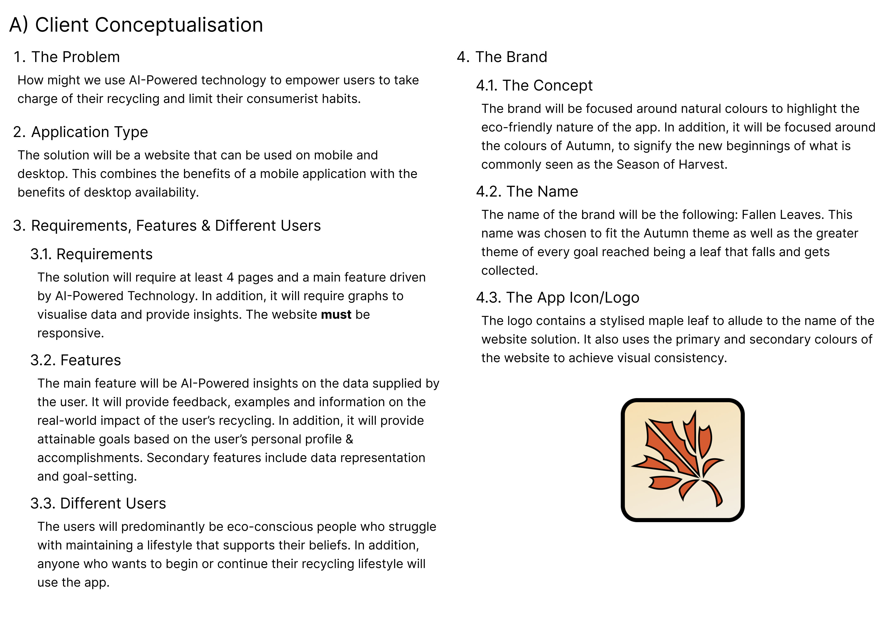
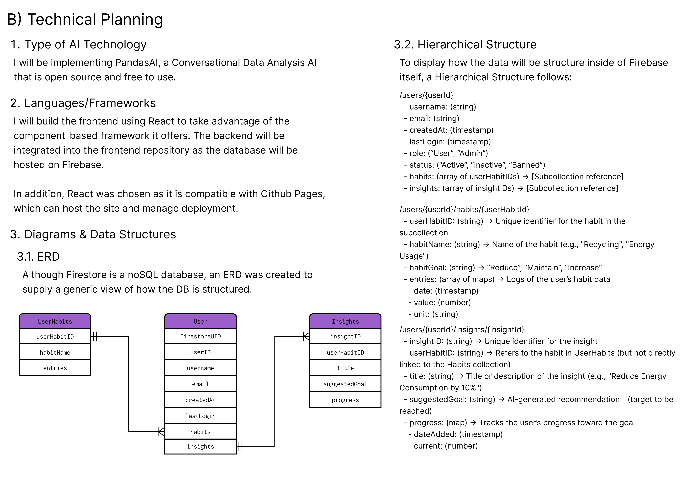
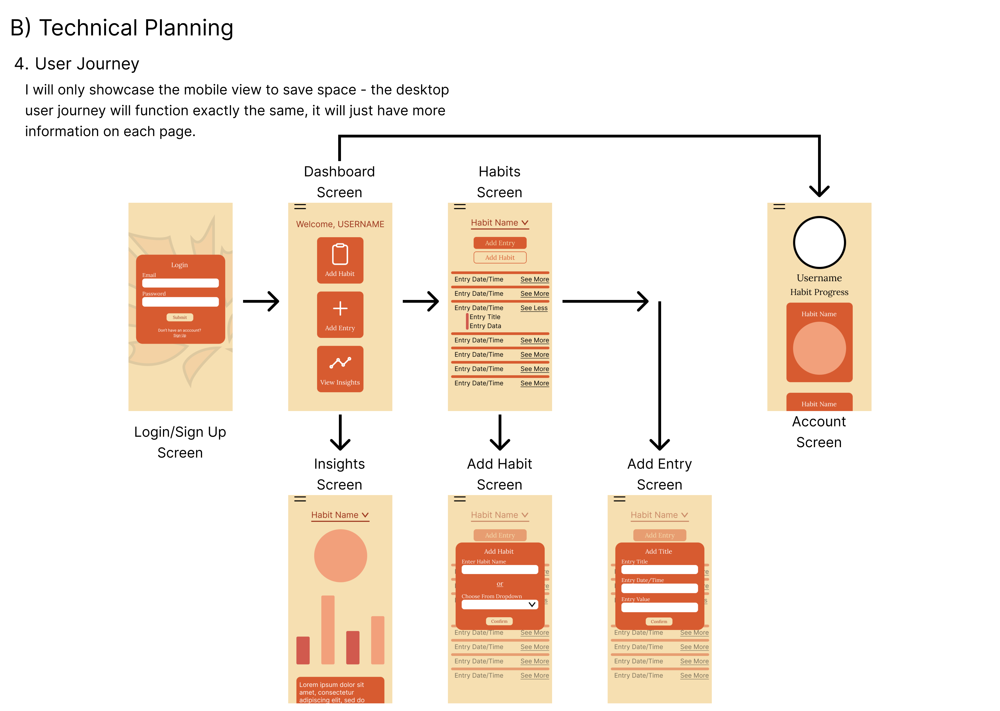
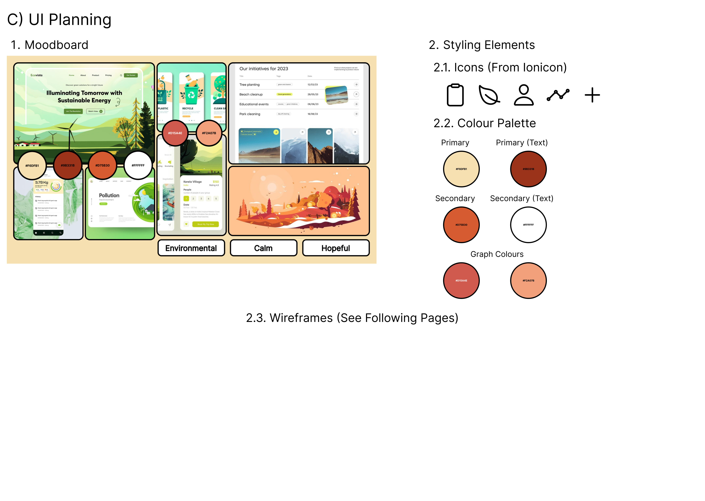
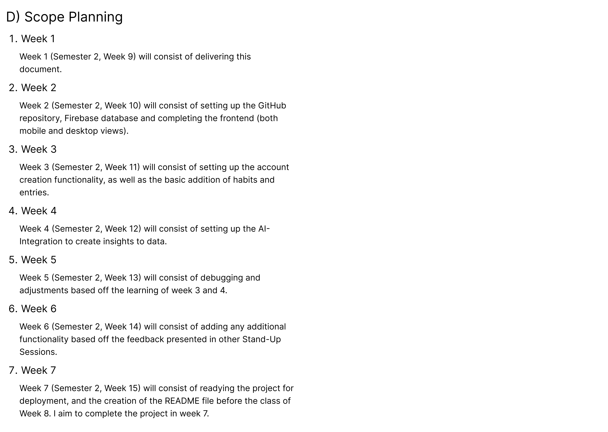
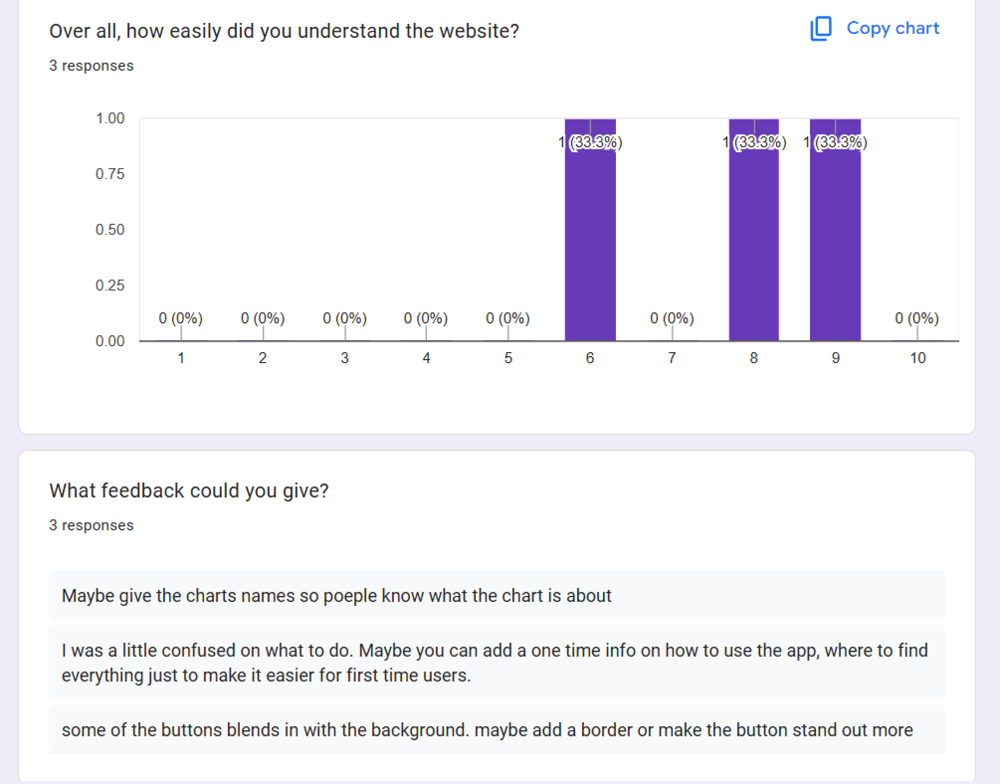
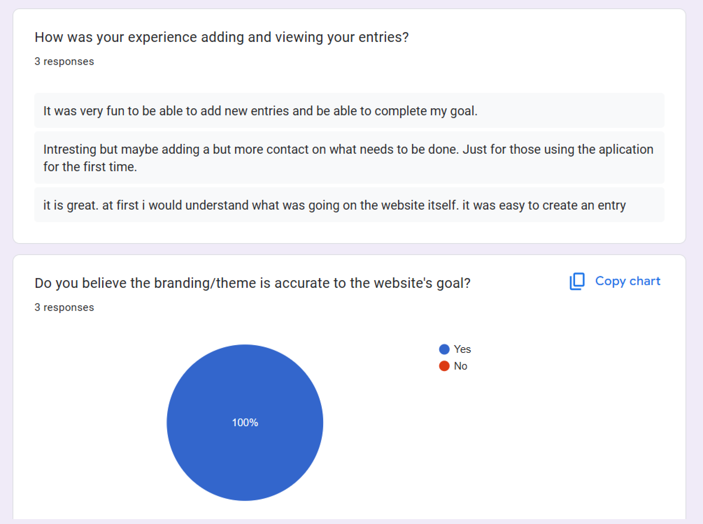
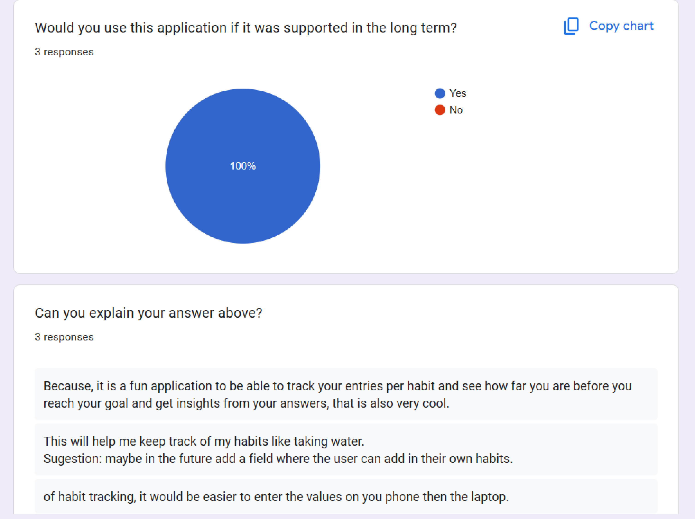
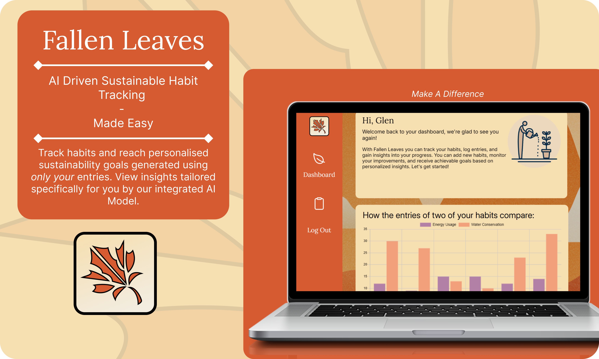
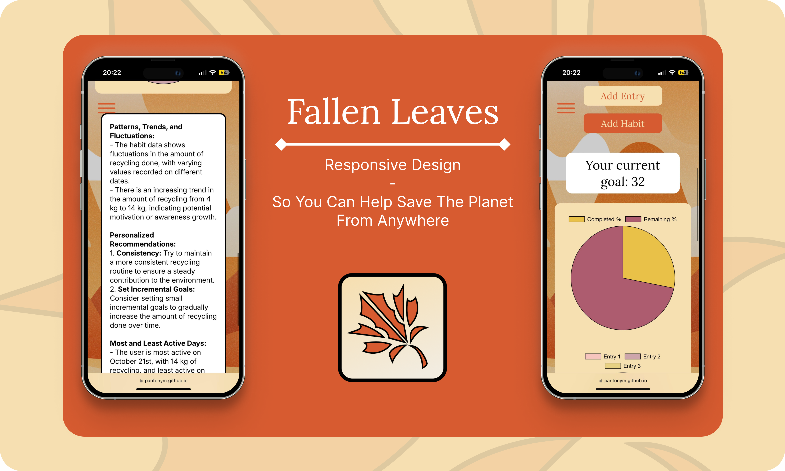

<!-- Project Info -->
<br>


<!-- Logo and link to repository -->
<p align="center">
  <a href="https://github.com/Pantonym/DV300Term4">
    
  </a>
</p>

<!-- Short Description -->
<h3 align="center">Fallen Leaves: Sustain the World</h3>
<p align="center"> This is a habit tracking web application utilizing AI to generate insights from user data
    <br>
    <!-- Bug and New Feature Links -->
    <a href="https://github.com/Pantonym/DV300Term4/issues">Report Bug</a>
    <a href="https://github.com/Pantonym/DV300Term4/issues">Request Feature</a>
    <br>
</p>

<!-- Name and Number In Alphabetical Order -->
<div>
    <h5 align="center" style="padding:0;margin:0;">Nico van Wyk</h5>
    <h5 align="center" style="padding:0;margin:0;">Student Number: 221179</h5>
    <br>
</div>
<!-- Subject and Term -->
<h6 align="center">DV300 | Term 4</h6>
<h6 align="center"><a href="https://pantonym.github.io/DV300Term4/">Deployment Link</a></h6>

<!-- TABLE OF CONTENTS -->
## Table of Contents

- [Table of Contents](#table-of-contents)
- [About the Project](#about-the-project)
  - [Featured Mockup](#featured-mockup)
  - [Project Description](#project-description)
  - [Technologies Used](#technologies-used)
  - [Built With](#built-with)
    - [React Web](#react-web)
    - [OpenAI API](#openai-api)
    - [Firebase](#firebase)
- [Getting Started](#getting-started)
  - [Prerequisites](#prerequisites)
  - [Installation](#installation)
- [Features and Functionality](#features-and-functionality)
- [Development Process](#development-process)
  - [Architecture](#architecture)
  - [Design Frame](#design-frame)
  - [Solution](#solution)
  - [Theme](#theme)
  - [Development Documents](#development-documents)
  - [Peer Reviews](#peer-reviews)
    - [Highlights](#highlights)
    - [Challenges](#challenges)
  - [Future Implementation](#future-implementation)
- [Final Outcome](#final-outcome)
  - [Mockups](#mockups)
  - [Video Demonstration](#video-demonstration)
- [License](#license)
- [Authors](#authors)
- [Contact](#contact)
- [Acknowledgements](#acknowledgements)
- [References](#references)

<!-- About the Project -->
## About the Project

<!-- Mockup -->
### Featured Mockup


<!--PROJECT DESCRIPTION-->
### Project Description
Fallen Leaves is a habit tracking web application where users can add entries to different habits and complete goals generated for them based on their data. They can also view insights that were created based off their habit data. 
### Technologies Used
* React Web
* OpenAI
* Firebase

### Built With
<!-- React Web -->
#### React Web
* A JavaScript library used to build the frontend of the application.
* Uses components to render the front end.
* Used for responsive development.
<p>React Web was used to build the front end.</p>


<!-- OpenAI -->
#### OpenAI API
* Large Language Model that can generate responses from text input.
* Contacted through Axios.
<p>The OpenAI API was used to generate insights and new goals for users based on their data.</p>


<!-- Firebase -->
#### Firebase
* Cloud Computing Service used to create the backend of the application.
* Axios was used to contact it.
* Is a NoSQL database.
* Firebase was used for text-based data, as well as user data.
<p>Firebase/Firestore was used to implement backend functionality to implement CRUD functionality to the application.</p>


<!-- GETTING STARTED -->
## Getting Started
These instructions will get you a copy of the project up and running on your local machine for development and testing purposes.

### Prerequisites
For development and testing, the latest version of Node.js is required, which is available here: [Node.js](https://nodejs.org/en).

### Installation
Here are a couple of ways to clone this repo:

1.  GitHub Desktop </br>
    Enter `https://github.com/Pantonym/DV300Term4.git` into the URL field and press the `Clone` button.
</br>
2.  Clone Repository </br>
    Run the following in the command-line to clone the project:

    ```sh
    git clone https://github.com/Pantonym/DV300Term4.git
    ```
The following installations are required if you do not clone the repository:
* Click on Terminal and open a new terminal
* Install Dependencies:

  * npm install
</br>

* Start Application:
  * npm start

</br>

* List of Dependencies:
1. npm install react-router-dom
2. npm install gh-pages --save-dev
3. npm install firebase
4. npm i axios
5. npm install ionicons
6. npm install chart.js react-chartjs-2
7. npm i react-loader-spinner
8. pm i dotenv
9. npm i axios-retry

<!-- Main Features and Functionality -->
## Features and Functionality
1. AI Integration
* To contact the API, a secret API key was generated to authenticate requests.
``` 
export const callOpenAiAPI = async (habitData) => {
  try {
    if (!apiKey) {
      throw new Error("API key is missing. Please check your environment variables.");
    }

    const prompt = `...`;
    const response = await axios.post(API_URL, {
      model: 'gpt-3.5-turbo', // Use the gpt-3.5-turbo model
      messages: [
        { role: 'system', content: 'You are an assistant.' },
        { role: 'user', content: prompt }
      ],
      max_tokens: 300, // The maximum amount of tokens usable for this request
      temperature: 0.3, // Controls creativity/randomness
    }, {
      headers: {
      'Content-Type': 'application/json',
      'Authorization': `Bearer ${apiKey}`
    }
  });
  return response.data.choices[0].message.content // Extract the response's text
  } catch (error) {...}
```
</br>

* The data was formatted before it was sent to the API to make it more understandable.
```
export const formatForApi = (habitData) => {
  // --Ensures the entries are an array
  const entries = Array.isArray(habitData.entries) ? habitData.entries : [];

  // --Structure the habit data in a more readable format to help the AI not become confused
  const formattedEntries = entries.map(entry => {
    const formattedDate = entry.date.toDate ? entry.date.toDate().toLocaleDateString() : entry.date; // ----Convert the Timestamp to a readable date
    return `Date: ${formattedDate}, Value: ${entry.value} ${entry.unit}`;
  }).join('\n');

  // --Format the habit data to be more readable for the API
  return `
  Habit Name: ${habitData.habitName}
  Habit Goal: ${habitData.habitGoal}
  Entries:
  ${formattedEntries}
  `;
};
```
</br>

* The following prompt was used to generate feedback:
```
const prompt = `Analyze the following habit data and provide insights.
  - Identify patterns, trends, and fluctuations in the habit data.
  - Provide 2-3 personalized recommendations based on the data.
  - Identify which days or periods the user is most or least active and suggest adjustments.
  - Provide an attainable goal and ensure it is a **specific number** and calculated based on the total sum of all the values in the entries. The goal should either be equal to, slightly lower, or slightly higher than the total sum of the entries.
  - **IMPORTANT**: At the end, provide the goal in the exact format [GOAL: number] without units or additional text. 
  - The goal should be realistic based on the analysis of the data. 
  - **IMPORTANT**: In addition, provide a suitable title in the exact format [TITLE: string].
  Data: ${habitData}`;
```
</br>

* After feedback is generated, the insights title and new goal is extracted and all the info is saved to firebase:
```
const apiResponse = await callOpenAiAPI(formattedHabitData);

// Extract the goal using regex
const goalMatch = apiResponse.match(/\[GOAL:\s*(.*?)\]/);

// If a goal is found, display it
let extractedGoal = null;
if (goalMatch && goalMatch[1]) {
  extractedGoal = parseInt(goalMatch[1], 10); // Convert the string to an integer
  console.log('Extracted Goal: ', extractedGoal);
}

// Extract the title using regex
const titleMatch = apiResponse.match(/\[TITLE:\s*(.*?)\]/);

// If a title is found, display it
let extractedTitle = null;
if (titleMatch && titleMatch[1]) {
  extractedTitle = titleMatch[1];
  console.log('Extracted Title: ', extractedTitle);
}

// If both title and goal were extracted, save the new insight to Firestore
if (extractedGoal && extractedTitle) {
  await addInsight(
    ...
  );
  console.log('New insight saved successfully!');
  // Fetch the data again to refresh the table
  fetchUserData(currentUser.uid);
} else {
  console.log('An error occurred when extracting the goal & title');
}
```

2. Adding An Entry
* An entry is built, and then it is tested to see if the user has completed their goal or not.
``` 
const handleAddEntrySubmissionClick = async () => {
try {
  const newEntry = {
    date: new Date(),
    value: entryValue,
    unit: unit
};

// --Recalculate the current amount in the insights collection matching the active one
if (selectedInsightToDisplay && selectedInsightToDisplay.id) {
  const newCurrent = selectedInsightToDisplay.current + parseFloat(entryValue);

  // ----Update the current progress in the Firestore document for the insight
  await updateInsight(userID, selectedInsightToDisplay.id, { current: newCurrent });

  // ----If goal is completed, add the new entry and generate a new insight
  if (newCurrent >= selectedInsightToDisplay.suggestedGoal) {
    // ----Update the local version of selectedHabitToDisplay
    const updatedEntries = [...selectedHabitToDisplay.entries, newEntry];
    const updatedHabit = {
      ...selectedHabitToDisplay,
      entries: updatedEntries,
    };
  ...
  await addEntryToHabit(userID, selectedHabitToDisplay.id, newEntry);

  // ----Update the insight and generate a new one with the updated habit
  await updateInsight(userID, selectedInsightToDisplay.id, { completed: true });
  handleGenerateInsight(updatedHabit); // Pass the updated habit to ensure new entry is included
  } else {
...
  // ----Add the entry to the Firestore document for the selected habit
  await addEntryToHabit(userID, selectedHabitToDisplay.id, newEntry);
  fetchUserData(currentUser.uid);
  }
...
```
</br>

* The user can also edit entries that have been added already:
```
try {
  // --Create a copy of the entries array to modify
  const updatedEntries = [...entries];

  for (const index in editedEntries) {
    // ----Find the original entry
    const originalEntry = updatedEntries[index];

    const updatedEntry = {
      ...originalEntry,
      value: editedEntries[index].value, // ------Only modify the value field
      // ----Ensure the date is preserved as a Firestore Timestamp - just in case as it can be disastrous is allowd to be saved incorrectly.
      date: originalEntry.date instanceof Timestamp
      ? originalEntry.date
      : new Timestamp(originalEntry.date.seconds, originalEntry.date.nanoseconds)
    };

    // ----Update the page's version of the entries array so it matches the db's
    updatedEntries[index] = updatedEntry;
  }

  // --Call the service function to update the entries in Firestore
  await updateHabitEntries(userID, habit.id, updatedEntries);

  setEntries(updatedEntries);  // Update the useState with the updated entries
  setEditedEntries({});        // Clear the editedEntries state since changes have been saved

  alert('Entries updated successfully!');
} catch (error) {...}
```

3. User Functionality
* User profiles are created using Firebase Auth's built in functionality:
```
const userCredential = await createUserWithEmailAndPassword(auth, email, password);
const user = userCredential.user;
// Create a new user profile using the information supplied
await createUserProfile({
  uid: user.uid,
  email: user.email,
  username: username
});
```
</br>

* Then, a user profile is created to save login details, their role and status
```
export const createUserProfile = async (user) => {
    const { uid, email, username } = user;

    // Find the correct user that was just created
    const userDoc = doc(db, usersCollection, uid);

    const userData = {
        email: email,
        username: username,
        avatar: 'defaultURL',
        dateOfRegistration: serverTimestamp(),
        lastLoginDate: serverTimestamp(),
        role: 'user',
        status: 'active'
    };

    // Add user data to Firestore
    await setDoc(userDoc, userData);
}
```
</br>

* When a user logs in using Firebase's built in functionality, persistence is activated as well:
```
// Log In a user
async function login(email, password) {
try {
  // Enable Persistence
  await setPersistence(auth, browserLocalPersistence);

  // Sign In
  const userCredential = await signInWithEmailAndPassword(auth, email, password);

  // Update the user's last log in date
  await updateUserLastLogin(userCredential.user.uid);

  return userCredential.user;
} catch (error) {
  console.error('Login Error:', error);
  throw error;
  }
}
```


<!-- DEVELOPMENT PROCESS -->
## Development Process
### Architecture
The application consists of multiple React Web pages and components. It communicates with a NoSQL database to receive and send information. `Firebase.js` was created to contact the database, and service files handled functionality. Finally, OpenAI API was contacted to implement AI-generated insights and goals.
### Design Frame
How might we create a web-based application that hosts a user's habits and entries, allowing them to track these habits and receive feedback and insights on them?
### Solution
Fallen Leaves, a web-based application that allows users to add entries to their habits and receive AI-Driven feedback.
### Theme
Fallen Leaves was designed to evoke feelings of Autumn. This is meant to tie it to the idea of nature, as well as 'new beginnings' where the user can form new and better habits to help save the environment.

### Development Documents
<!-- Client Conceptualization -->


<!-- Technical Planning -->




<!-- UI Planning -->


<!-- Scope Planning -->


<!-- Screen Mockups -->
* Initial Wireframes
[Google Drive Folder](https://drive.google.com/drive/folders/1ds77uGPMgETMYpSploQ_1Hho1pgSzN-B?usp=sharing)

<!-- Peer reviews -->
### Peer Reviews
* Peer reviews were conducted to help improve the application. The feedback provided was implemented, as well as feedback provided from the lecturer during contact sessions.







<!-- Highlights -->
#### Highlights
* The largest highlight was that we were given nearly complete creative control over the project, and were able to manage it like a project in the real world.
* Learning about neural networks was very interesting.
* Seeing AI return data in real time with a deployed application was very interesting.
* Using React Web after the React Native project in Term 2 was very fun as I have a passion for React.

<!-- Challenges -->
<!-- Explain the challenges faced with the project and why you think you faced it or how you think you'll solve it (if not solved), or how you solved it -->
#### Challenges
* Finding the correct AI to use for this project was a challenge. Many free options were not compatible with the project setup, and eventually I chose to use OpenAI despite it being a paid method.
* Securing the API Key for OpenAI was also a challenge as deploying through Github Pages and React Web revealed the secrets in my ENV file - I had to find a new way to secure it for deployment.
* It was also a challenge to not overreach. I had many ideas to add to the project, but I had to pace myself to ensure the basic functionality was complete first, before I added more.
* I also had to refactor the project - both to improve the UI and to combine pages with similar functionality.

<!-- Future Implementation -->
### Future Implementation
* Users can add their own measurements to each entry
* Users can add their own habits
* A detailed new user guide through the app

<!-- Final Outcome -->
## Final Outcome
<!-- MOCKUPS -->
### Mockups





<br>

<!-- Video Demonstration -->
### Video Demonstration
**Video Demonstration:** <a href="https://drive.google.com/drive/folders/1mlqiFTQRIYItin67QLQkBOuZwRfMbBLK?usp=sharing">Google Drive Link</a>
**Demo Video:** <a href="https://youtu.be/i3ciczWsOGw">Youtube Link</a>

<!-- LICENSE -->
## License
This repository is proprietary and distributed with all rights reserved. Use, copying, modification, or distribution of this software is prohibited without explicit permission from Nico van Wyk. 

<!-- AUTHORS -->
## Authors
* **Nico van Wyk** - [Github](https://github.com/Pantonym)

<!-- Contact -->
## Contact
**Nico van Wyk** - [221179@virtualwindow.co.za](mailto:221179@virtualwindow.co.za)

<!-- ACKNOWLEDGEMENTS -->
<!-- all resources that you used and Acknowledgements here -->
## Acknowledgements
* [Lecturer](https://github.com/ArmandPretorius), for supplying contact sessions and coding knowledge.
* [Figma](https://www.figma.com/), for interface design.
* [Firebase](https://firebase.google.com/docs/firestore/), for providing documentation on data management.
* [ChatGPT](https://chatgpt.com), for help with debugging.
* [OpenAI](https://openai.com), for supplying documentation on API implementation.

## References
* [Link](https://www.google.com/url?sa=i&url=https%3A%2F%2Flogos-world.net%2Freact-logo%2F&psig=AOvVaw2P245paSsFyJN9zdGsBKdK&ust=1731254259875000&source=images&cd=vfe&opi=89978449&ved=0CBQQjRxqFwoTCKD1j-7Oz4kDFQAAAAAdAAAAABAE) (React Web Logo)
* [Link](https://www.google.com/url?sa=i&url=https%3A%2F%2Fen.m.wikipedia.org%2Fwiki%2FFile%3AOpenAI_Logo.svg&psig=AOvVaw2iNOSaZqxzadPX1uzW8fht&ust=1731254720353000&source=images&cd=vfe&opi=89978449&ved=0CBQQjRxqFwoTCKDRgcfQz4kDFQAAAAAdAAAAABAI) (OpenAI Logo)
* [Link](https://firebase.google.com/brand-guidelines) (Firebase) 